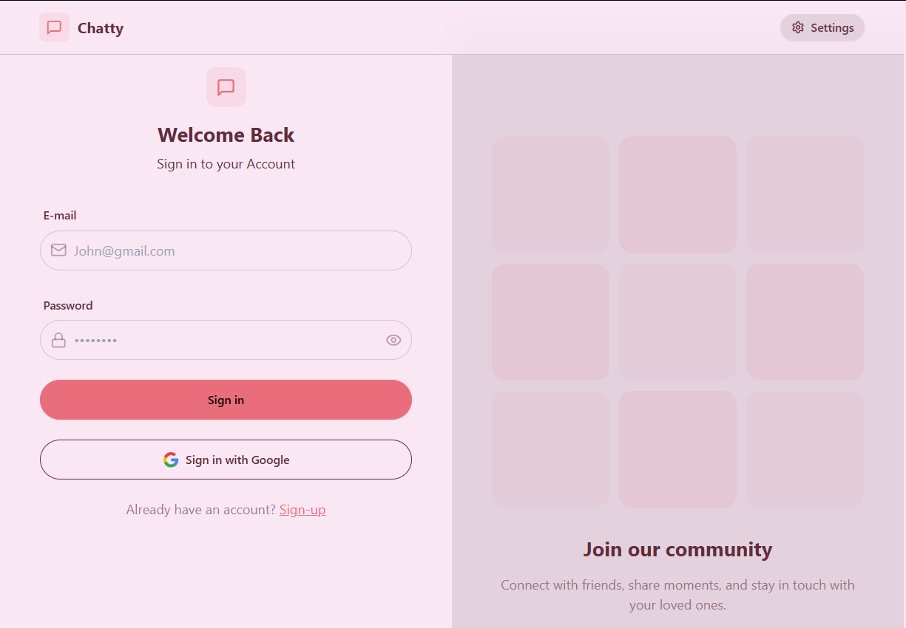
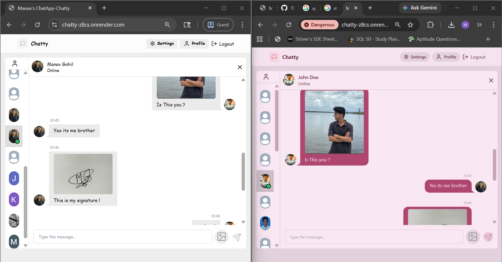

# Chatty - A Modern Real-Time Chat Application 💬

Chatty is a full-stack, real-time messaging application built with the MERN stack (MongoDB, Express, React, Node.js) and Socket.io. It features a polished UI with 30+ themes, image uploads via Cloudinary, and real-time user presence tracking.

## Live Demo

Check out the live application here: **[https://chatty-z8cs.onrender.com/](https://chatty-z8cs.onrender.com/)**

> [!IMPORTANT]
> Since this project is deployed on Render's free tier, the backend might take a minute to "spin up" when you first visit. Please be patient while it gets back to work!

---

## Screenshots

<div align="center">
  <h3>Sign In Page</h3>
  
  
  <br/>
  
  <h3>Real-Time Chat Interface</h3>
  
</div>

---

## Features

- **Real-Time Messaging**: Instant communication powered by Socket.io.
- **Authentication**: Secure JWT-based auth and Google OAuth integration.
- **Dynamic Themes**: Choose from 30+ elegant themes powered by daisyUI.
- **Profile Customization**: Upload and update profile pictures using Cloudinary.
- **Presence Tracking**: See when your friends are online or offline in real-time.
- **Responsive Design**: Fully optimized for mobile, tablet, and desktop screens.
- **Toast Notifications**: Interactive alerts for login, signup, and messaging.

---

## Tech Stack

### Frontend
- **React**: Modern component-based UI.
- **Vite**: Ultra-fast build tool and dev server.
- **Tailwind CSS**: Utility-first styling.
- **daisyUI**: Premium component library for Tailwind.
- **Zustand**: Lightweight and scalable state management.
- **Socket.io-client**: Real-time bidirectional communication.
- **Lucide React**: Beautiful icons.

### Backend
- **Node.js**: Server-side JavaScript runtime.
- **Express**: Fast, unopinionated web framework.
- **MongoDB**: NoSQL database for flexible data storage.
- **Socket.io**: Real-time event communication.
- **Cloudinary**: Cloud-based image management.
- **Passport.js**: Social authentication (Google OAuth).
- **JWT**: Secure token-based authentication.

---

##  Local Setup

Follow these steps to run the project locally:

1. **Clone the repository**:
   ```bash
   git clone https://github.com/TheManavGohil/chat-app
   cd chatty-final
   ```

2. **Install dependencies**:
   ```bash
   # Install backend dependencies
   cd backend
   npm install
   
   # Install frontend dependencies
   cd ../frontend
   npm install
   ```

3. **Environment Variables**:
   Create a `.env` file in the `backend` directory and add the following:
   ```env
   MONGODB_URI=your_mongodb_uri
   JWT_SECRET=your_jwt_secret
   CLOUDINARY_CLOUD_NAME=your_cloud_name
   CLOUDINARY_API_KEY=your_api_key
   CLOUDINARY_API_SECRET=your_api_secret
   NODE_ENV=development
   
   # Optional: Google OAuth
   GOOGLE_CLIENT_ID=your_client_id
   GOOGLE_CLIENT_SECRET=your_client_secret
   ```

4. **Run the application**:
   ```bash
   # In /backend
   npm run dev
   
   # In /frontend
   npm run dev
   ```

---

## Contact

- **Email**: [gohilmanav2005@gmail.com]

## Contribution

Contributions are always welcome! Feel free to open an issue or submit a pull request.

---
